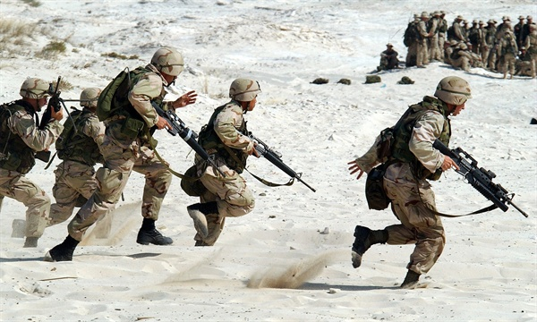
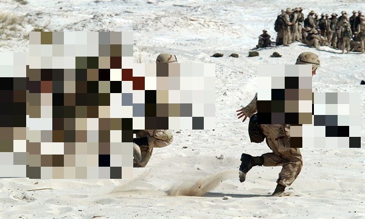

# Canary yolov5

## Train yolov5 in local
```
python clone_code/train.py --img 640 --batch 16 --epochs 3 --data data/dataset.yaml --weights yolov5m6.pt
```

## Train yolov5 in azure
```
python train_with_azure.py
```

## Mosaic image
```
pip install -qr https://raw.githubusercontent.com/ultralytics/yolov5/master/requirements.txt  # install dependencies
pip install opencv-python googledrivedownloader
python detect.py -w [WEIGHT PATH] -i [INPUT IMAGE PATH] -o [OUTPUT IMAGE PATH] -o2 [OUTPUT WARNING TXT PATH]
```
ex)
```
python detect.py -w ./weight/yolov5m6.pt -i ./image/soldier2.jpg -o ./image/out.jpg -o2 ./image/out_warning.txt
```


