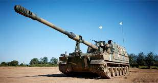
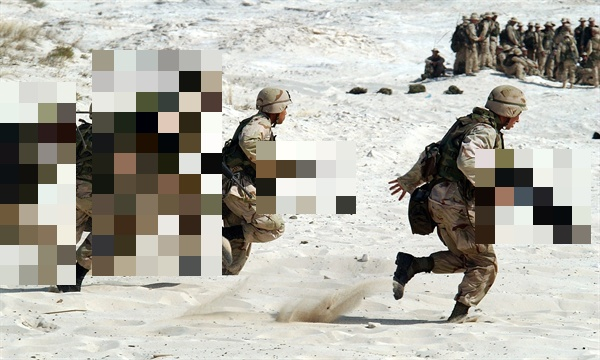

# Canary yolov5

## Prepare dataset
```
pip install -r requirements.txt
python download_imagenet_data.py
python download_custom_data.py
```

## Train yolov5
```
git clone https://github.com/ultralytics/yolov5 clone_code
mv dataset clone_code
cd clone_code
mv dataset/dataset.yaml data/dataset.yaml
pip install -r requirements.txt
python train.py --img 640 --batch 16 --epochs 3 --data dataset.yaml --weights yolov5s.pt
```

## Mosaic image
```
pip install -qr https://raw.githubusercontent.com/ultralytics/yolov5/master/requirements.txt  # install dependencies
pip install opencv-python
python detect.py -w [WEIGHT PATH] -i [INPUT IMAGE PATH] -o [OUTPUT IMAGE PATH]
```
ex)
```
python detect.py -w ./weight/best.pt -i ./image/k9.jpg -o ./image/out.jpg
```


